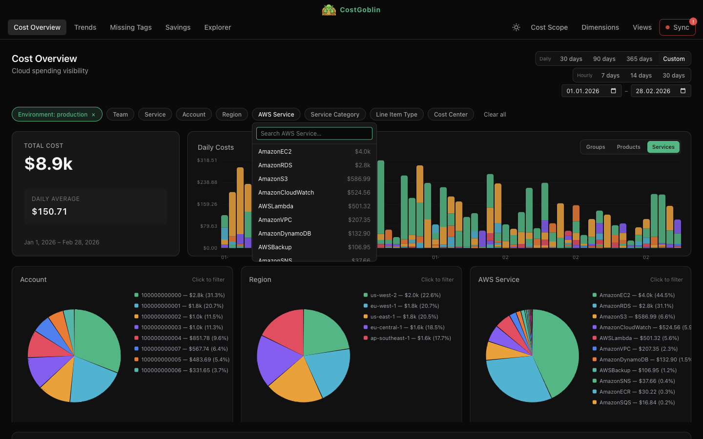
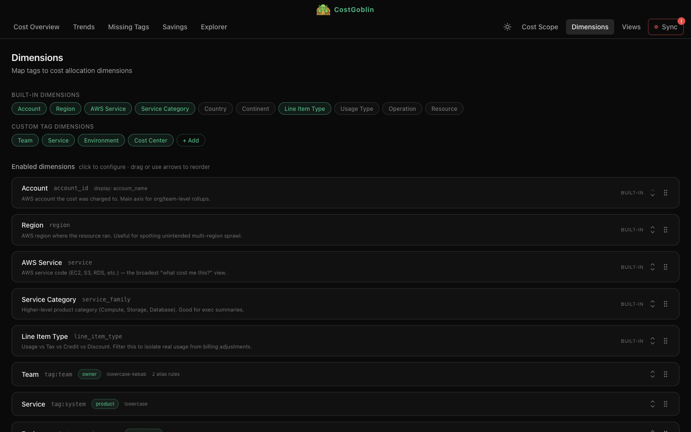
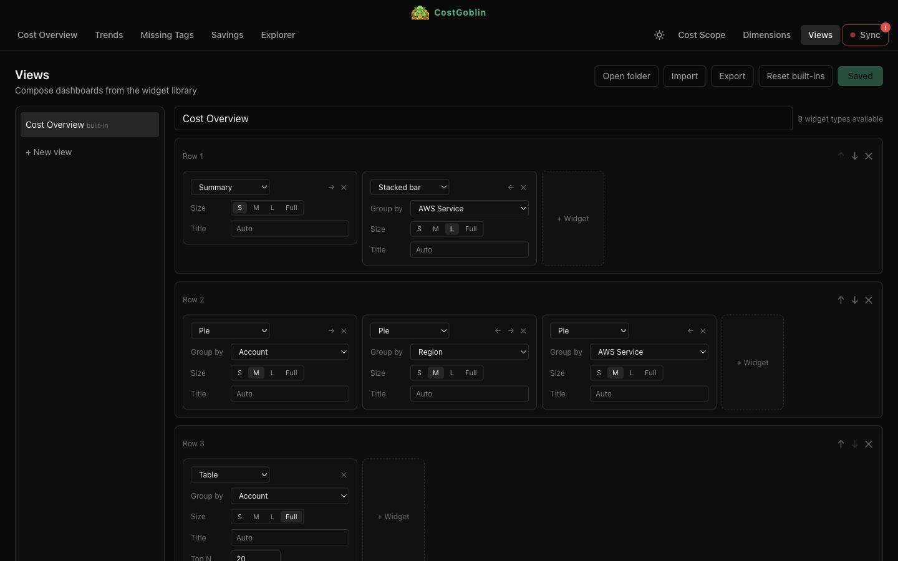
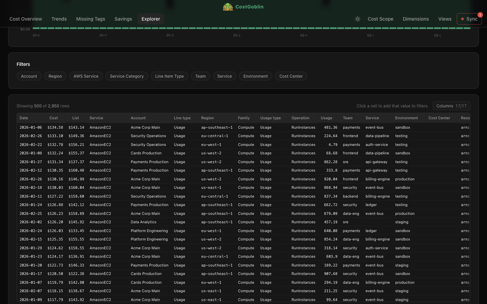

<p align="center">
  
</p>

<h1 align="center">CostGoblin</h1>

<p align="center">
  Cloud cost visibility that runs on your machine.<br>
  No servers, no SaaS fees, no third-party data sharing.
</p>

<p align="center">
  <a href="https://github.com/etiennechabert/cost-goblin/blob/main/LICENSE"></a>
  
  
  
  <a href="https://github.com/etiennechabert/cost-goblin/actions/workflows/ci.yml"></a>
  <a href="https://buymeacoffee.com/etiennechak"></a>
</p>

<p align="center">
  <a href="https://costgoblin.com">Website</a> &middot;
  <a href="#quick-start">Quick Start</a> &middot;
  <a href="#features">Features</a>
</p>

<p align="center">
  
</p>

CostGoblin is a desktop app that syncs your AWS billing data locally and queries it with DuckDB. Filter, drill down, and slice costs by any dimension — from a plane at 10,000 meters.

## Quick Start

```bash
npm install
make dev
```

On first launch, the setup wizard guides you through connecting to your AWS CUR data.

## Prerequisites

- **Node.js** 20+
- **AWS CUR 2.0** report exported as Parquet to S3

### Setting Up a CUR Report

If you don't have a CUR report yet, create one in the [AWS Console](https://docs.aws.amazon.com/cur/latest/userguide/cur-create.html).

**Report settings:**

| Setting | Value |
|---------|-------|
| Report type | CUR 2.0 (Data Exports) |
| Time granularity | Daily |
| Format | Parquet |
| Compression | Parquet (Snappy) |
| Additional content | **Include resource IDs** + **Include net columns** (both) |

**Why both "additional content" boxes.** Each ticks on a family of columns that the app uses for a specific metric / perspective. Tick only one and you get half the matrix — the app still runs, but Amortized and/or Net silently fall back to Unblended.

| Setting | Unlocks | Without it |
|---------|---------|------------|
| *Include resource IDs* | Amortized metric (accurate RI/SP smoothing) + the resource_id column Missing-Tags analysis needs | Amortized degrades to Unblended; Missing Tags view can't isolate resources |
| *Include net columns* | Net perspective (credits / refunds / promotional discounts applied) | Net falls back to Gross on every metric |

**Required columns** — the base set the app needs to function:

| Column | Purpose |
|--------|---------|
| `line_item_usage_start_date` | Date partitioning |
| `line_item_usage_account_id` | Account dimension |
| `line_item_usage_account_name` | Account display name |
| `line_item_line_item_type` | Charge type (Usage / Fee / Credit / Tax / RIFee / ...). Drives Cost Scope exclusion rules |
| `line_item_line_item_description` | Line item description |
| `line_item_operation` | AWS operation |
| `line_item_usage_type` | Usage details |
| `line_item_usage_amount` | Usage quantity |
| `line_item_resource_id` | Resource ARN (Missing-Tags analysis) |
| `line_item_unblended_cost` | Primary cost metric. **Always required** — the universal fallback for every metric / perspective combination |
| `pricing_public_on_demand_cost` | On-demand list price (shown alongside cost in Line Items table) |
| `product_servicecode` | AWS service code (e.g. `AmazonEC2`) |
| `product_product_family` | Service family (e.g. `Compute Instance`) |
| `product_region_code` | AWS region |
| `resource_tags` | Tag key-value pairs |

**Cost-metric columns** — pick both variants of each pair so Gross *and* Net views stay accurate:

| Column | Unlocks |
|--------|---------|
| `line_item_blended_cost` | **Blended** metric (consolidated-billing weighted average) |
| `line_item_net_unblended_cost` | **Net** perspective for every metric |
| `reservation_effective_cost` | **Amortized** metric, Gross — RI-covered usage |
| `reservation_net_effective_cost` | **Amortized** metric, Net — RI-covered usage |
| `savings_plan_savings_plan_effective_cost` | **Amortized** metric, Gross — SP-covered usage |
| `savings_plan_net_savings_plan_effective_cost` | **Amortized** metric, Net — SP-covered usage |

> The doubled prefix on the SP columns is AWS's snake_case conversion of `savingsPlan/SavingsPlanEffectiveCost` — not a typo.

**Metric × Perspective matrix** — the column the app actually reads for each UI selection (first available, in priority order):

| Selection | Reads from (first available wins) |
|-----------|-----------------------------------|
| Unblended · Gross | `line_item_unblended_cost` |
| Unblended · Net | `line_item_net_unblended_cost` → `line_item_unblended_cost` |
| Blended · Gross | `line_item_blended_cost` → `line_item_unblended_cost` |
| Blended · Net | `line_item_net_unblended_cost` → `line_item_blended_cost` → `line_item_unblended_cost` [^1] |
| Amortized · Gross | `reservation_effective_cost` → `savings_plan_savings_plan_effective_cost` → `line_item_unblended_cost` |
| Amortized · Net | `reservation_net_effective_cost` → `savings_plan_net_savings_plan_effective_cost` → `line_item_net_unblended_cost` → `line_item_unblended_cost` |

[^1]: AWS doesn't publish a standalone `line_item_net_blended_cost` — Blended × Net uses the next-closest net accounting column.

**What the app does on first launch.** It probes your parquet schema once (cached per session) and shows an inline warning next to any degraded metric / perspective combination in the Cost Scope view. Queries never fail with a missing-column error; they fall back down the chain.

**Changing the settings.** CUR reports are immutable, so enabling *Include resource IDs* / *Include net columns* on an existing report requires creating a new report. Point it at the same (or a fresh) S3 prefix, wait one billing cycle for the new columns to land, then point CostGoblin at the updated prefix.

The S3 export should look like:
```
s3://bucket/prefix/
  data/
    BILLING_PERIOD=YYYY-MM/
      *.snappy.parquet
  metadata/
    BILLING_PERIOD=YYYY-MM/
      manifest.json
```

### AWS Credentials

CostGoblin reads profiles from `~/.aws/config` and `~/.aws/credentials`. The wizard lists available profiles and lets you pick one.

**Using SSO:**
```bash
aws configure sso
aws sso login --profile your-profile-name
```

**Without giving the app S3 access:**
Skip the wizard and download CUR data manually:
```bash
aws s3 sync s3://your-bucket/path/to/cur/ ~/Library/Application\ Support/@costgoblin/desktop/data/raw/
```
Then use the Data tab to repartition the downloaded files.

## Features

- **S3 billing sync** — downloads CUR parquet files into optimized daily Hive partitions
- **Interactive dashboard** — pie charts for accounts/services/tags, stacked daily histogram, drill-down
- **Filter by any dimension** — account, service, region, team, product, environment, or custom tags
- **Custom dimensions** — map any AWS tag to a first-class cost allocation dimension
- **Tag normalization** — aliases applied at query time, fix messy tags without re-processing
- **Composable views** — drag-and-drop widget builder with 9 widget types
- **Service drill-down** — click through service → service family breakdowns
- **Period-over-period comparison** — vs previous period delta on the summary card
- **CSV export** — export any view for reporting
- **Works offline** — once synced, no internet needed

<details>
<summary><strong>Dimensions</strong> — map tags to cost allocation dimensions</summary>
<br>

</details>

<details>
<summary><strong>Views</strong> — compose dashboards from the widget library</summary>
<br>

</details>

<details>
<summary><strong>Explorer</strong> — drill into individual line items</summary>
<br>

</details>

## Architecture

```
packages/
  core/     @costgoblin/core — DuckDB queries, S3 sync, config (no framework deps)
  ui/       @costgoblin/ui — React components (visx charts, Tailwind, shadcn/ui)
  desktop/  Electron shell — imports core and ui
```

- **DuckDB** for analytical queries over local Parquet files
- **Electron** for cross-platform desktop app
- **React 19** + **visx** (D3 primitives as React components) for charts
- **Tailwind CSS v4** for styling

## Development

```bash
make help       # show available commands
make dev        # launch Electron in dev mode
make test       # run vitest
make lint       # run tsc + eslint
make reset      # wipe app data, restart with wizard
```

## License

CostGoblin is licensed under the **GNU Affero General Public License v3.0 only** (AGPL-3.0-only). See [`LICENSE`](./LICENSE) for the full text.

In short:
- You can use, modify, and redistribute CostGoblin freely.
- If you distribute modified versions, or make them available over a network (e.g. host a fork as a service), you must publish your modifications under the same license.
- Commercial use is permitted; what the AGPL prevents is closed-source forks and undisclosed SaaS re-hosting.

If you want to embed CostGoblin in a closed-source product or ship it under different terms, a commercial license is available on request — contact the author.
