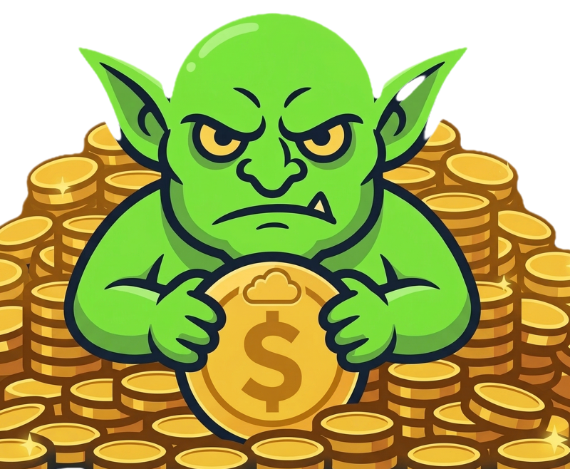
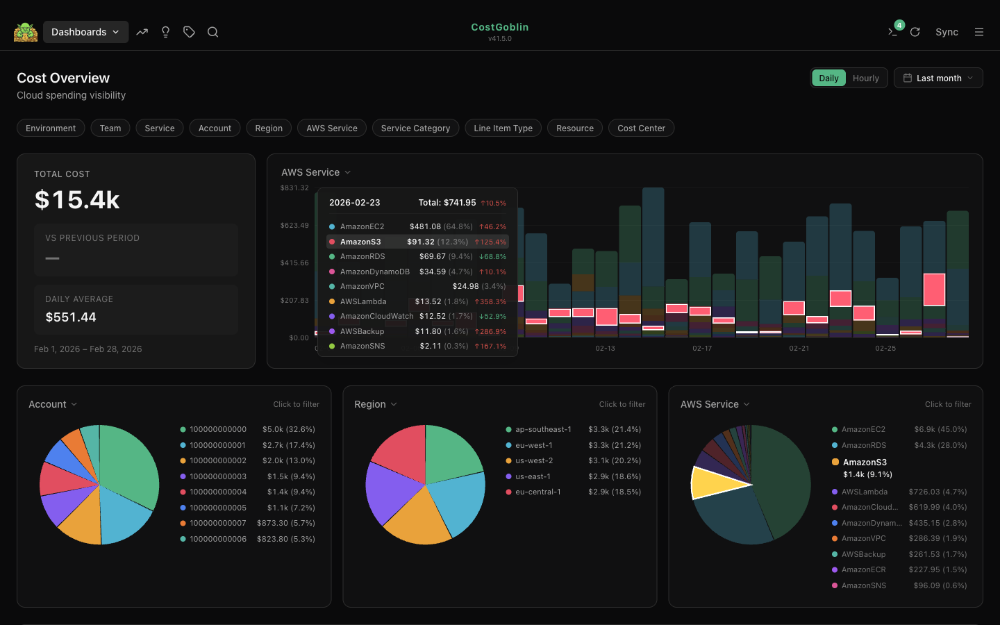

<p align="center">
  
</p>

<h1 align="center">CostGoblin</h1>

<p align="center">
  Cloud cost visibility that runs on your machine.<br>
  No servers, no SaaS fees, no third-party data sharing.
</p>

<p align="center">
  <a href="https://github.com/etiennechabert/cost-goblin/blob/main/LICENSE"></a>
  
  
  
  <a href="https://github.com/etiennechabert/cost-goblin/actions/workflows/ci.yml"></a>
</p>

<p align="center">
  <a href="https://sonarcloud.io/summary/new_code?id=etiennechabert_cost-goblin"></a>
  <a href="https://sonarcloud.io/summary/new_code?id=etiennechabert_cost-goblin"></a>
  <a href="https://sonarcloud.io/summary/new_code?id=etiennechabert_cost-goblin"></a>
</p>

<p align="center">
  <a href="https://buymeacoffee.com/etiennechak"></a>
  <a href="https://sentry.io"></a>
</p>

<h3 align="center">
  <a href="https://costgoblin.com">costgoblin.com</a>
</h3>

<p align="center">
  <a href="https://costgoblin.com/#download">Download</a> &middot;
  <a href="#quick-start">Get Started</a> &middot;
  <a href="#features">Features</a>
</p>

<p align="center">
  
</p>

CostGoblin is a desktop app that syncs your AWS billing data locally and queries it with DuckDB. Filter, drill down, and slice costs by any dimension — from a plane at 10,000 meters.

## Install

Download the latest release for your platform from [costgoblin.com](https://costgoblin.com/#download). macOS binaries are signed and notarized. See the [code signing policy](https://costgoblin.com/code-signing.html) for details.

The app auto-updates when a new version is available.

## Quick Start

```bash
npm install
make dev
```

On first launch, the setup wizard guides you through connecting to your AWS CUR data.

## Prerequisites

- **Node.js** 24+
- **AWS CUR 2.0** report exported as Parquet to S3

### Setting Up a CUR Report

CostGoblin reads **CUR 2.0 via AWS Data Exports** (not legacy CUR). Create one in the [AWS Billing Console → Data Exports](https://docs.aws.amazon.com/cur/latest/userguide/what-is-data-exports.html).

**Export settings:**

| Setting | Value |
|---------|-------|
| Export type | **Standard data export** (table: `COST_AND_USAGE_REPORT`) |
| Time granularity | Daily |
| Format | Parquet |
| Compression | Snappy |
| Overwrite | Overwrite existing data export file |

> CUR 2.0 Data Exports does **not** have "Include resource IDs" / "Include net columns" checkboxes — those are legacy CUR. In Data Exports you pick the columns explicitly in the SQL editor (see below).

#### Columns to select

Paste this into the **SQL query** field when creating the export. It's the full set of columns CostGoblin can read — extras you don't paste become inline "Degraded" warnings in Cost Scope but never break queries.

```sql
SELECT
  -- Required: app won't function without these
  line_item_usage_start_date,
  line_item_usage_account_id,
  line_item_usage_account_name,
  line_item_line_item_type,
  line_item_line_item_description,
  line_item_operation,
  line_item_usage_type,
  line_item_usage_amount,
  line_item_resource_id,
  line_item_unblended_cost,
  product_servicecode,
  product_product_family,
  product_region_code,
  resource_tags,
  -- Recommended: each unlocks one metric option in Cost Scope
  pricing_public_on_demand_cost,            -- "On-demand list price" metric
  reservation_effective_cost,               -- "Amortized" metric (RI portion)
  savings_plan_savings_plan_effective_cost, -- "Amortized" metric (SP portion)
  -- Optional: enables the "Net" perspective (credits/refunds applied)
  line_item_net_unblended_cost,
  reservation_net_effective_cost,
  savings_plan_net_savings_plan_effective_cost
FROM COST_AND_USAGE_REPORT
```

> The doubled prefix on `savings_plan_savings_plan_effective_cost` is AWS's snake_case conversion of `savingsPlan/SavingsPlanEffectiveCost` — not a typo. Same for the `_net_` variant.

> **Why no `line_item_blended_cost`?** CostGoblin intentionally doesn't ship AWS's "Blended" metric. It was designed to distribute classic RI discounts fairly across linked accounts when commitments sat in a central payer account — but AWS never extended the math to Savings Plans, and SPs are how virtually all modern fleets buy commitment-based discounts. On an SP-based fleet, Blended is nearly indistinguishable from Unblended and provides none of the chargeback fairness it was originally invented for. We use **Amortized** for chargeback (it spreads SP/RI fees correctly across covered usage) and **On-demand list price** for fair per-team cost views when commitment allocation is uneven. If your config still has `costMetric: "blended"` it's silently migrated to `amortized` at load time. Skipping this column also keeps your CUR export lighter.

#### What each tier unlocks

| Tier | If you skip these |
|------|-------------------|
| **Required** | App won't ingest the export at all |
| **Recommended** | The matching metric in Cost Scope shows "Degraded — falls back to Unblended"; numbers are still correct under the Unblended metric |
| **Optional (Net)** | The Net perspective toggle silently falls back to Gross |

The app probes your parquet schema once at startup and shows the warning inline next to each affected metric. Queries never error on a missing column — they fall through to the next available one.

#### Already have an export running with fewer columns?

CUR 2.0 exports are immutable, so you can't add columns to an existing export. Create a new one with the full SQL above, point it at a fresh S3 prefix, wait one billing cycle for the first partition to land, then update CostGoblin's S3 prefix in the setup wizard.

<details>
<summary><strong>Reference: which column wires up which metric × perspective</strong></summary>

For each metric / perspective combo, the app reads the **first available** column in priority order, falling back down the chain when a column isn't in the export:

| Selection | Reads from |
|-----------|------------|
| Unblended · Gross | `line_item_unblended_cost` |
| Unblended · Net | `line_item_net_unblended_cost` → `line_item_unblended_cost` |
| Amortized · Gross | `CASE` on `line_item_line_item_type`: `DiscountedUsage` → `reservation_effective_cost`; `SavingsPlanCoveredUsage` → `savings_plan_savings_plan_effective_cost`; RI/SP fee rows → `0`; everything else → `line_item_unblended_cost` |
| Amortized · Net | Same `CASE`, but using the `_net_` variants of each column and `line_item_net_unblended_cost` as the fallback |
| On-demand list price | `pricing_public_on_demand_cost` → `line_item_unblended_cost` |

The Amortized expression uses a `CASE` on `line_item_type` rather than a plain `COALESCE` because AWS populates `reservation_effective_cost` and `savings_plan_savings_plan_effective_cost` with `0` (not `NULL`) for non-applicable rows — a `COALESCE` chain would silently zero out every Usage / Tax / Credit row.

</details>

The S3 export should look like:
```
s3://bucket/prefix/
  data/
    BILLING_PERIOD=YYYY-MM/
      *.snappy.parquet
  metadata/
    BILLING_PERIOD=YYYY-MM/
      manifest.json
```

### AWS Credentials

CostGoblin reads profiles from `~/.aws/config` and `~/.aws/credentials`. The wizard lists available profiles and lets you pick one.

**Using SSO:**

The app has a built-in SSO login button — click it next to your profile and CostGoblin will launch `aws sso login` for you. Or run it manually:
```bash
aws configure sso
aws sso login --profile your-profile-name
```

**Without giving the app S3 access:**
Skip the wizard and download CUR data manually:
```bash
aws s3 sync s3://your-bucket/path/to/cur/ ~/Library/Application\ Support/@costgoblin/desktop/data/raw/
```
Then use the Data tab to repartition the downloaded files.

## Features

- **S3 billing sync** — downloads CUR parquet files into daily Hive partitions
- **Interactive dashboard** — pie charts, stacked bar charts, treemaps, and more, with drill-down into any dimension
- **Trends** — period-over-period comparison with bubble chart visualization, filterable by dimension with configurable thresholds
- **Findings** — surfaces AWS cost optimization recommendations (rightsize, delete unused, purchase SPs/RIs) with effort estimates and savings projections
- **Missing Tags** — identifies untagged resources by taggability, with Slack/Jira copy and CSV export
- **Explorer** — browse raw line items with configurable columns, filters, and sorting
- **Filter by any dimension** — account, service, region, team, product, environment, or custom tags
- **Custom dimensions** — map any AWS tag to a first-class cost allocation dimension
- **Tag normalization** — aliases applied at query time, fix messy tags without re-processing
- **Composable views** — drag-and-drop widget builder with 9 widget types (pie, bar, stacked bar, line, treemap, heatmap, bubble, table, summary)
- **Cost Scope** — configure cost metrics (amortized, on-demand list price, unblended) and exclusion rules
- **Vault encryption** — optional AES-256-GCM at-rest encryption for local billing data, with system keychain integration
- **MCP server** — Model Context Protocol integration for querying cost data from AI assistants
- **Dark/light mode** — theme toggle with two chart color palettes (standard + Okabe-Ito colorblind-safe)
- **Auto-updates** — the app checks for new versions on startup and installs them automatically
- **CSV export** — export any view for reporting
- **Works offline** — once synced, no internet needed


## Architecture

```
packages/
  core/     @costgoblin/core — DuckDB queries, S3 sync, config (no framework deps)
  ui/       @costgoblin/ui — React components (visx charts, Tailwind, shadcn/ui)
  desktop/  Electron shell — imports core and ui
  mcp/      @costgoblin/mcp — Model Context Protocol server for AI assistant integration
```

- **DuckDB** for analytical queries over local Parquet files
- **Electron** for cross-platform desktop app
- **React 19** + **visx** (D3 primitives as React components) for charts
- **Tailwind CSS v4** for styling

## Development

```bash
make help       # show available commands
make dev        # launch Electron in dev mode
make test       # run vitest
make lint       # run tsc + eslint
make reset      # wipe app data, restart with wizard
make fuzz       # soak the query-param fuzzer (brute-force bug hunting)
make fuzz-ui    # soak the UI monkey (random clicks through the real app)
```

## Backed by

CostGoblin is free and open source — kept that way with the help of companies that support open-source projects:

- **[Sentry](https://sentry.io)** — error monitoring, via their [open-source program](https://sentry.io/for/open-source/)
- **[SonarCloud](https://sonarcloud.io)** — code quality & static analysis
- **[GitHub](https://github.com)** — repository hosting & CI
- **[Cloudflare](https://www.cloudflare.com)** — website hosting & CDN

## License

CostGoblin is licensed under the **GNU Affero General Public License v3.0 only** (AGPL-3.0-only). See [`LICENSE`](./LICENSE) for the full text.

In short:
- You can use, modify, and redistribute CostGoblin freely.
- If you distribute modified versions, or make them available over a network (e.g. host a fork as a service), you must publish your modifications under the same license.
- Commercial use is permitted; what the AGPL prevents is closed-source forks and undisclosed SaaS re-hosting.

If you want to embed CostGoblin in a closed-source product or ship it under different terms, a commercial license is available on request — contact the author.
