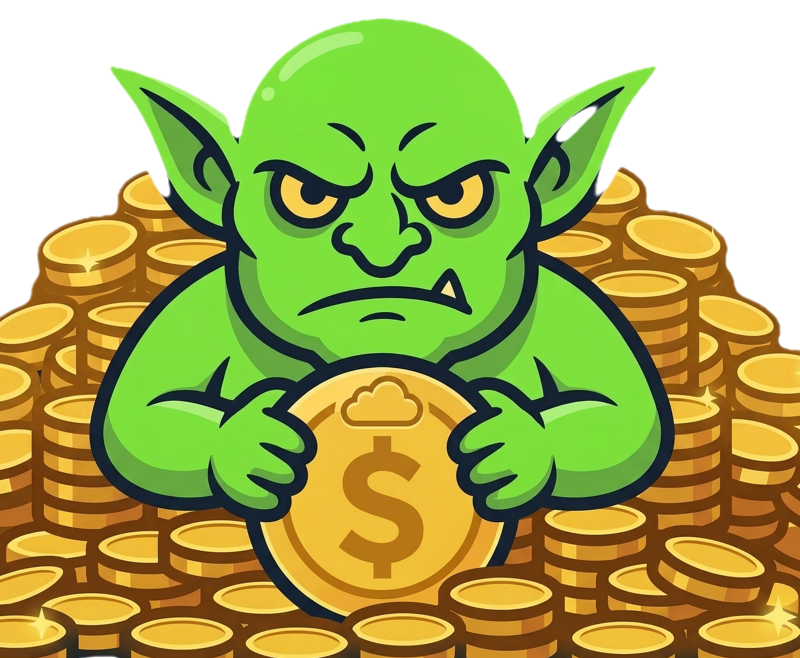
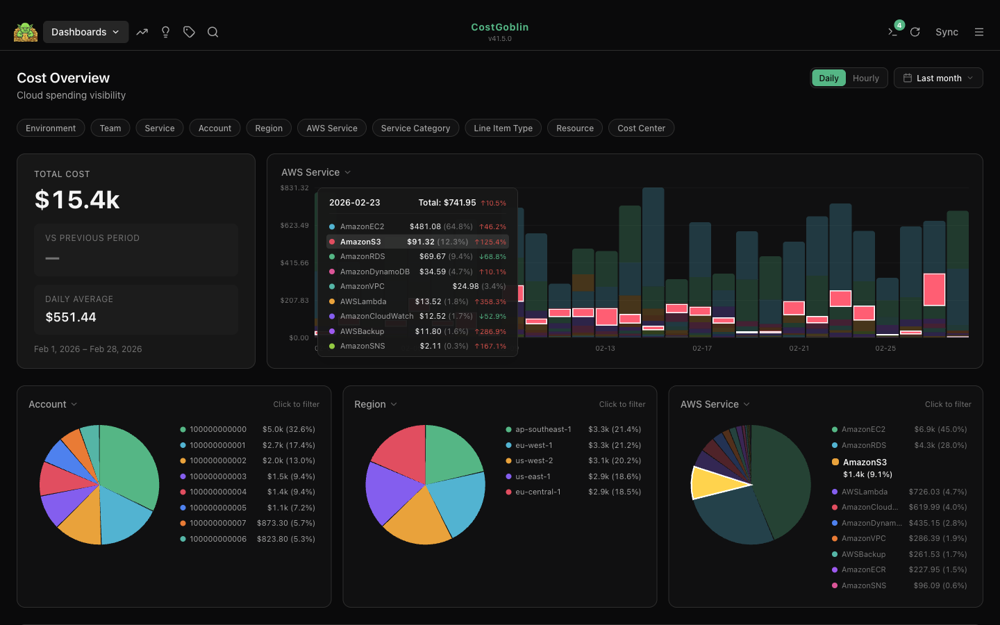

<p align="center">
  
</p>

<h1 align="center">CostGoblin</h1>

<p align="center">
  Cloud cost visibility that runs on your machine.<br>
  No servers, no SaaS fees, and your billing data stays local.<br>
  Release builds check GitHub Releases for updates at launch (can be turned off).
</p>

<p align="center">
  <a href="https://github.com/etiennechabert/cost-goblin/blob/main/LICENSE"></a>
  
  
  
  <a href="https://github.com/etiennechabert/cost-goblin/actions/workflows/ci.yml"></a>
</p>

<p align="center">
  <a href="https://sonarcloud.io/summary/new_code?id=etiennechabert_cost-goblin"></a>
  <a href="https://sonarcloud.io/summary/new_code?id=etiennechabert_cost-goblin"></a>
  <a href="https://sonarcloud.io/summary/new_code?id=etiennechabert_cost-goblin"></a>
</p>

<p align="center">
  <a href="https://buymeacoffee.com/etiennechak"></a>
  <a href="https://sentry.io"></a>
</p>

<h3 align="center">
  <a href="https://costgoblin.com">costgoblin.com</a>
</h3>

<p align="center">
  <a href="https://costgoblin.com/#download">Download</a> &middot;
  <a href="#quick-start">Get Started</a> &middot;
  <a href="#features">Features</a>
</p>

<p align="center">
  
</p>

CostGoblin is a desktop app that syncs your AWS billing data locally and queries it with DuckDB. Filter, drill down, and slice costs by any dimension — from a plane at 10,000 meters.

## Install

Download the latest release for your platform from [costgoblin.com](https://costgoblin.com/#download). macOS binaries are signed and notarized. See the [code signing policy](https://costgoblin.com/code-signing.html) for details.

Release builds check GitHub Releases for a new version once at launch and prompt you when one is out. Downloading and installing are one click each and never happen without your confirmation; **Check for updates** in Settings → General runs a check on demand. To turn the launch check off, choose **Manual only** under Settings → General → Update check (saved per workspace), or set `COSTGOBLIN_DISABLE_UPDATE_CHECK=1` in the app's environment, which covers every workspace (macOS GUI apps don't read shell profiles: use `launchctl setenv COSTGOBLIN_DISABLE_UPDATE_CHECK 1`, e.g. from an MDM LaunchAgent). Turning it off is advisable where github.com is blocked. The prompt is a notification, not a patching mechanism: fleets should enforce versions through MDM.

## Quick Start

```bash
npm install
make dev
```

On first launch, the setup wizard guides you through connecting to your AWS billing data.

## Prerequisites

- **Node.js** 24+
- At least one billing source:
  - **AWS** — a FOCUS 1.2 Data Export delivered as Parquet to S3 (below)
  - **GCP** — the native FOCUS BigQuery export, copied into a GCS bucket by [the FOCUS exporter](scripts/gcp-focus-exporter/README.md)

A workspace can configure several providers at once; totals sum across them and a `provider` dimension splits them apart.

### Setting Up a FOCUS 1.2 Export

CostGoblin reads the **FOCUS 1.2** table via AWS Data Exports. To create one:

1. In the AWS console, open **Billing and Cost Management**.
2. In the left navigation, choose **Data Exports** ([direct console link](https://us-east-1.console.aws.amazon.com/costmanagement/home#/bcm-data-exports)).
3. Click **Create export** and select **FOCUS 1.2** as the data table (`FOCUS_1_2_AWS`), with the settings below.

> ⚠️ Don't create the report from the legacy **Cost & Usage Reports** page, and don't pick the CUR 2.0 table — CostGoblin's schema is FOCUS 1.2. A correct export delivers Parquet files under `data/` and `metadata/` folders, partitioned by `billing_period=`.

**Export settings:**

| Setting | Value |
|---------|-------|
| Export type | **Standard data export** (table: `FOCUS_1_2_AWS`) |
| Time granularity | Daily (create an optional second export with Hourly for intraday drill-down) |
| Column selection | **All columns** |
| Format | Parquet |
| Compression | Snappy |
| Overwrite | Overwrite existing data export file |

#### Columns CostGoblin requires

Keeping **all columns** enabled is the simplest way to stay valid — the extras cost little in Parquet, and narrowing the export later leaves holes you can't backfill. For reference, these are the columns the app actually reads (a candidate export missing any of them is rejected by the setup wizard):

```
ChargePeriodStart, SubAccountId, SubAccountName,
BilledCost, EffectiveCost, ListCost, ContractedCost,
ServiceName, x_ServiceCode, ServiceCategory, RegionId, ResourceId,
ChargeCategory, PricingCategory, CommitmentDiscountStatus,
ChargeDescription, ConsumedQuantity, SkuMeter, Tags, x_Operation
```

All four FOCUS cost columns are always present in the export, so every cost metric is always available — there is no per-column "degraded metric" probing.

<details>
<summary><strong>Reference: which column backs which cost metric</strong></summary>

| Metric | Reads from | Meaning |
|--------|-----------|---------|
| Billed | `BilledCost` | The invoiced amount. Commitment-covered usage rows carry `0`; the invoiced fee sits on `ChargeCategory='Purchase'` rows. Use for invoice reconciliation. |
| Effective (amortized) | `EffectiveCost` | Amortized cost, including the **unused** portion of commitments (`CommitmentDiscountStatus='Unused'` rows). Matches Cost Explorer's amortized view. The default. |
| List price | `ListCost` | Hypothetical on-demand list price, restricted to `ChargeCategory='Usage'` rows (purchases/tax/credits have no list price). |
| Contracted | `ContractedCost` | Price after negotiated (e.g. EDP) discounts, before commitment discounts. `List − Contracted` is what your negotiated discount is worth. |

> **What happened to Unblended / Amortized / Net?** Those were CUR-era names: configs are migrated automatically (`unblended` → `billed`, `amortized`/`blended` → `effective`). The Net perspective is gone — FOCUS has no net cost columns; negotiated discounts are already netted into `BilledCost`/`ContractedCost`, with per-row detail in the `x_Discounts` map.

</details>

The S3 export should look like:
```
s3://bucket/prefix/<export-name>/
  data/
    billing_period=YYYY-MM/
      <export-name>-00001.snappy.parquet
  metadata/
    billing_period=YYYY-MM/
      <export-name>-Manifest.json
      <export-name>-Manifest-FOCUS.json
```

> **Historical data:** a new export only includes data from creation day onward. Open an AWS Support case to request a backfill for the export — AWS can typically reload up to 12 months.

### AWS Credentials

CostGoblin reads profiles from `~/.aws/config` and `~/.aws/credentials` — or from the files `AWS_CONFIG_FILE` / `AWS_SHARED_CREDENTIALS_FILE` point to, as the AWS CLI does. The wizard lists available profiles and lets you pick one.

**Using SSO:**

The app has a built-in SSO login button — click it next to your profile and CostGoblin will launch `aws sso login` for you. Or run it manually:
```bash
aws configure sso
aws sso login --profile your-profile-name
```

### GCP

GCP's billing data reaches CostGoblin through its native **FOCUS BigQuery export**. Because SQL cannot delete GCS objects — and stale export shards would silently inflate a month's totals — a small Cloud Run job in your own project copies each billing period into a bucket. CostGoblin then reads that bucket (plus your project and bucket lists while the wizard sets it up) and never calls BigQuery. Signed in as yourself with `gcloud auth application-default login`, though, it acts as you and can reach whatever your Google account can. On company or shared laptops, give it a read-only service account on the bucket and set `impersonateServiceAccount` — see [Credentials](scripts/gcp-focus-exporter/README.md#credentials) for how, and for what that does and does not confine.

[**scripts/gcp-focus-exporter**](scripts/gcp-focus-exporter/README.md) covers the whole path: enabling the export, deploying the job (Cloud Shell, local, or copy-paste), and the `costgoblin.yaml` entry that points the app at the result.

> On first run, pick **Google Cloud** on the setup screen. Once the exporter has run, the wizard browses your buckets the same way the AWS path browses S3 — pick the project, the bucket, then the tier folder, and it writes the config for you. It refuses the exporter's parent prefix (pointing a tier there would read every tier's shards) and an `hourly` folder that overlaps `daily`. Hand-editing `costgoblin.yaml` stays available from the same screen for credentials that can't list projects, such as a bare service-account key.

## Features

- **S3 billing sync** — downloads FOCUS 1.2 parquet files into per-month partitions
- **Interactive dashboard** — pie charts, stacked bar charts, treemaps, and more, with drill-down into any dimension
- **Trends** — period-over-period comparison with bubble chart visualization, filterable by dimension with configurable thresholds
- **Findings** — surfaces AWS cost optimization recommendations (rightsize, delete unused, purchase SPs/RIs) with effort estimates and savings projections
- **Missing Tags** — identifies untagged resources by taggability, with Slack/Jira copy and CSV export
- **Explorer** — browse raw line items with configurable columns, filters, and sorting
- **Filter by any dimension** — account, service, region, team, product, environment, or custom tags
- **Custom dimensions** — map any AWS tag to a first-class cost allocation dimension
- **Tag normalization** — aliases applied at query time, fix messy tags without re-processing
- **Composable views** — drag-and-drop widget builder with 9 widget types (pie, bar, stacked bar, line, treemap, heatmap, bubble, table, summary)
- **Cost Scope** — configure cost metrics (effective, billed, list price, contracted) and exclusion rules
- **MCP server** — Model Context Protocol integration for querying cost data from AI assistants (opt-in, off by default: enable it under Settings → AI Assistant; clients authenticate with an `Authorization: Bearer` token). Tool results carry values that anyone who can tag your cloud resources or edit a shared config file can write, so treat them as untrusted input: markdown output escapes `|` and both markdown and CSV escape line breaks to keep tables and rows intact, but that does not stop prompt injection. Set your AI client to require approval before it runs tools with side effects.
- **Dark/light mode** — theme toggle with two chart color palettes (standard + Okabe-Ito colorblind-safe)
- **Update notifications** — release builds check GitHub Releases once at launch and prompt when a new version is out; download and install are one click each, never unconfirmed. Turn the launch check off under Settings → General or with `COSTGOBLIN_DISABLE_UPDATE_CHECK=1` (see [Install](#install))
- **CSV export** — export any view for reporting
- **Works offline** — once synced, no internet needed

## Security & data at rest

Everything CostGoblin keeps locally is **stored unencrypted** under its app data directory — for example the downloaded billing Parquet (`workspaces/<name>/data/<provider>/raw/<tier>-YYYY-MM/`) and the rollups built from it, DuckDB spill files in `workspaces/<name>/temp/`, cached account names and tags in `workspaces/<name>/state/`, and the YAML config in `workspaces/<name>/config/`. There is no application-level encryption: anyone who can read those files can read your billing history.

The app data directory of a release build is:

| OS | Path |
|----|------|
| macOS | `~/Library/Application Support/costgoblin/` |
| Windows | `%APPDATA%\costgoblin\` |
| Linux | `~/.config/costgoblin/` (or `$XDG_CONFIG_HOME/costgoblin/`) |

A development run (`make dev` / `npm run dev`) uses a folder named `@costgoblin/desktop` in place of `costgoblin`. `COSTGOBLIN_USER_DATA_DIR` moves the whole directory elsewhere, and `COSTGOBLIN_DATA_DIR` / `COSTGOBLIN_CONFIG_DIR` switch to a pinned, non-workspace layout; everything below applies wherever the data ends up.

What protects that data is the operating system, so treat these as requirements:

- **Full-disk encryption** — FileVault (macOS), BitLocker (Windows) or LUKS (Linux). Without it, anyone holding a lost or stolen laptop's disk can read the billing data. Require it on every machine that runs CostGoblin.
- **A user-only data directory** — the app data directory is created readable only by your own account (on Windows, `%APPDATA%` is restricted to you by its ACLs). That keeps out other non-admin users of the same machine; it does not keep out an administrator or software running as you.
- **No unencrypted copies** — keep the directory out of unencrypted backups and out of cloud-sync folders, or they carry a readable copy somewhere else.

Secrets are written with file mode `0600` (owner read/write only): `mcp-auth-token` at the root of the app data directory, and in each workspace's `config/` the peer-sharing files `peer-identity.json`, `peer-sharing.json` and `peer-source.json` (your private key, your sharing access secret, and a teammate's sharing key). Windows ignores that mode, so there those files rely on the directory's ACLs alone. Every other file is written with default permissions.

Because `config/` holds those peer secrets, **share individual YAML files** (`costgoblin.yaml`, `dimensions.yaml`, …) with teammates or in version control — never the whole `config/` directory.

## Architecture

```
packages/
  core/     @costgoblin/core — DuckDB queries, S3 sync, config (no framework deps)
  ui/       @costgoblin/ui — React components (visx charts, Tailwind, shadcn/ui)
  desktop/  Electron shell — imports core and ui
  mcp/      @costgoblin/mcp — Model Context Protocol server for AI assistant integration
```

- **DuckDB** for analytical queries over local Parquet files
- **Electron** for cross-platform desktop app
- **React 19** + **visx** (D3 primitives as React components) for charts
- **Tailwind CSS v4** for styling

## Development

```bash
make help       # show available commands
make dev        # launch Electron in dev mode
make test       # run vitest
make lint       # run tsc + eslint
make reset      # wipe app data, restart with wizard
```

## Backed by

CostGoblin is free and open source — kept that way with the help of companies that support open-source projects:

- **[Sentry](https://sentry.io)** — error monitoring, via their [open-source program](https://sentry.io/for/open-source/)
- **[SonarCloud](https://sonarcloud.io)** — code quality & static analysis
- **[GitHub](https://github.com)** — repository hosting & CI
- **[Cloudflare](https://www.cloudflare.com)** — website hosting & CDN

## License

CostGoblin is licensed under the **GNU Affero General Public License v3.0 only** (AGPL-3.0-only). See [`LICENSE`](./LICENSE) for the full text.

In short:
- You can use, modify, and redistribute CostGoblin freely.
- If you distribute modified versions, or make them available over a network (e.g. host a fork as a service), you must publish your modifications under the same license.
- Commercial use is permitted; what the AGPL prevents is closed-source forks and undisclosed SaaS re-hosting.

If you want to embed CostGoblin in a closed-source product or ship it under different terms, a commercial license is available on request — contact the author.
